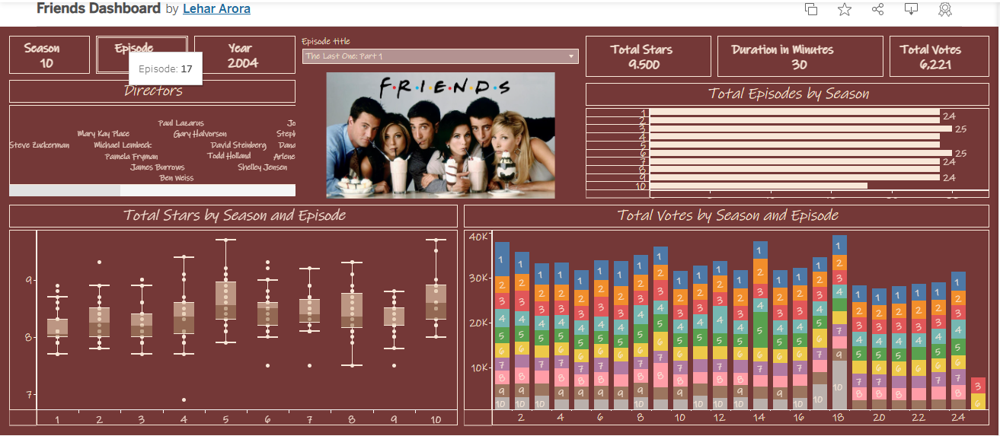

# 📺 Friends TV Show Dashboard (Tableau)

## 🎯 Objective
This dashboard explores episodes from the iconic TV show **Friends**, providing insights into season-wise ratings, vote counts, and standout episodes. Built using Tableau, it allows users to interact with the show's performance data in a visually engaging way.

---

## 📊 Dataset & Source
- **Source**: Dataset curated from public sources covering episode metadata (title, season, release year), user ratings, and vote counts.
- **Tool**: Developed entirely in Tableau Public.

---

## 🔍 Dashboard Features

### 📈 Visual Insights
- **Average Ratings by Season**: Line chart showing rating trends across all 10 seasons.
- **Vote Count by Season**: Secondary axis showcasing how popularity varied over time.
- **Top-Rated Episodes**: Highlighted using bar charts and annotations.
- **Episode Filter Panel**: Dropdowns and slicers to filter by season or rating.

### 🧠 Key Takeaways
- **Season 5 & 6** received the highest average ratings.
- Some episodes with **lower votes still rank among the highest rated**.
- There’s a visible **decline in vote counts in later seasons**, although ratings remained steady.

---

## 🛠️ Tools Used
- **Tableau Public**  
- **CSV Dataset** (manually cleaned for missing or inconsistent entries)

---

## 📌 Live Dashboard
🔗 [Click here to view on Tableau Public](https://public.tableau.com/views/FriendsDashboard_17521477687020/Dashboard1)

---

## 🙌 Credits
Thanks to **Rushikesh (YouTube)** for inspiration and guidance on Tableau dashboard design.

---

## 👩🏻‍💻 Author
**Lehar Arora**  
📧 [lehararora666@gmail.com](mailto:lehararora666@gmail.com)  
🔗 GitHub: [@lehararora](https://github.com/lehararora)

---
